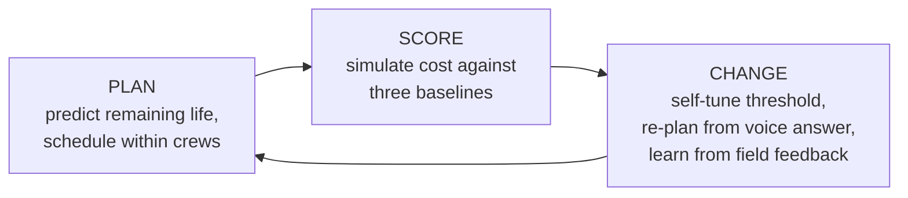
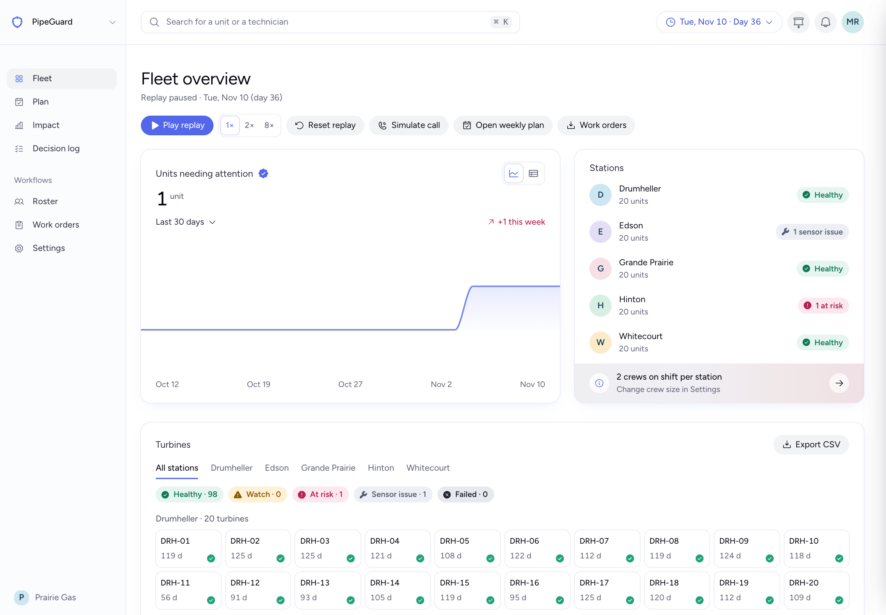
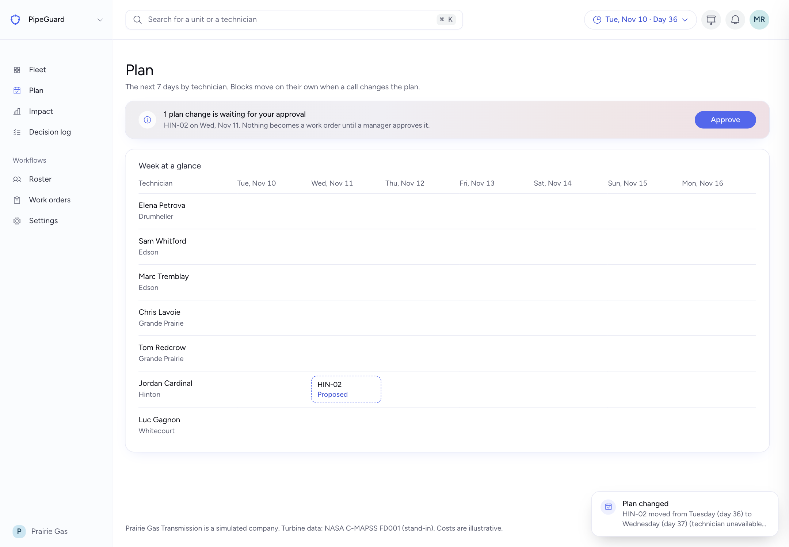
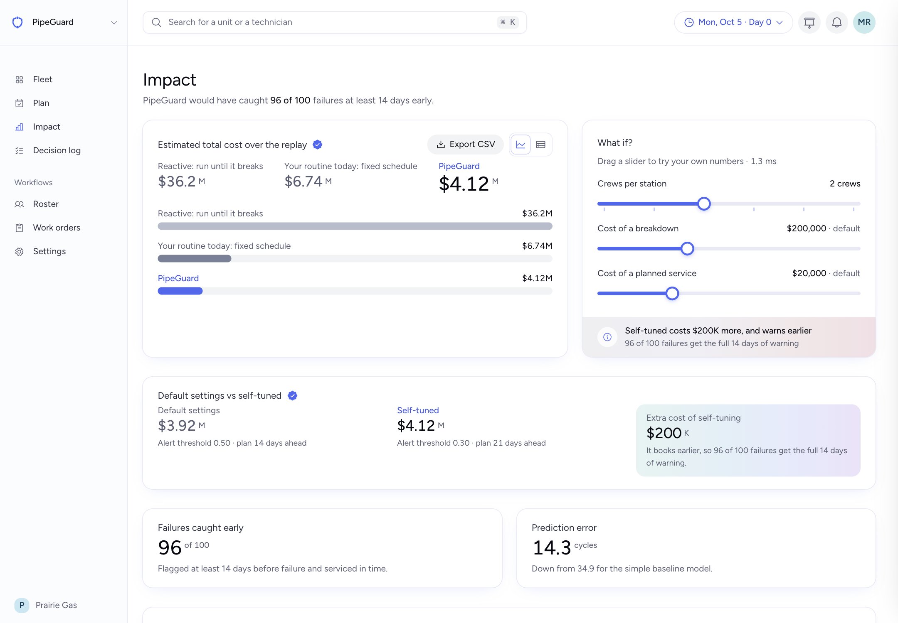
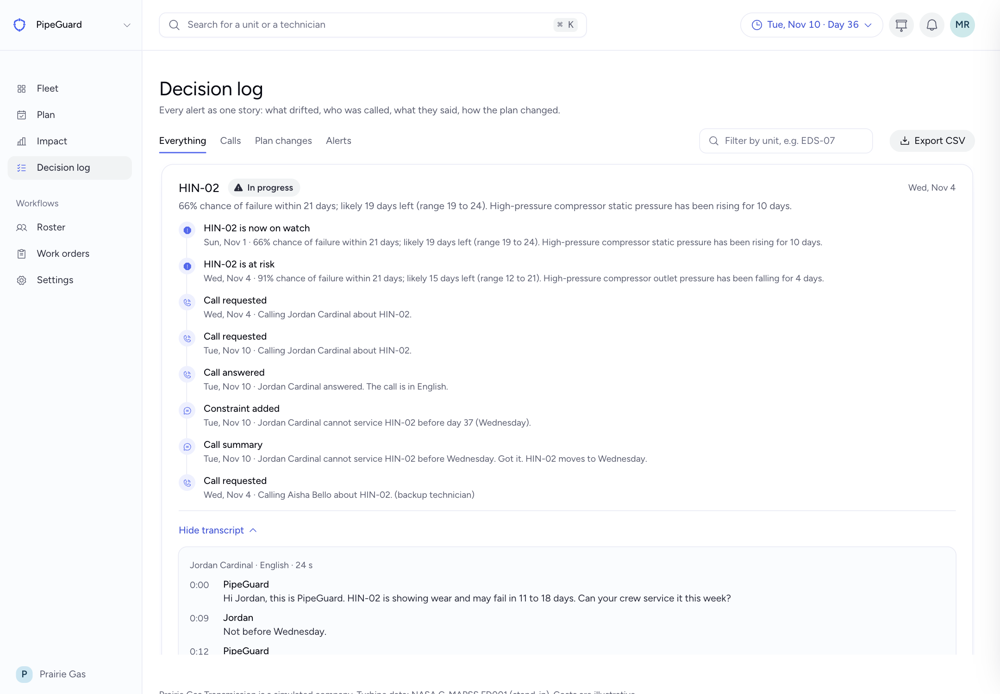
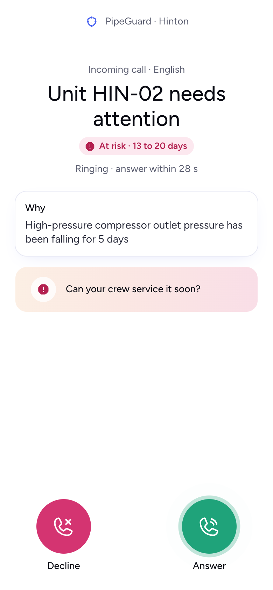
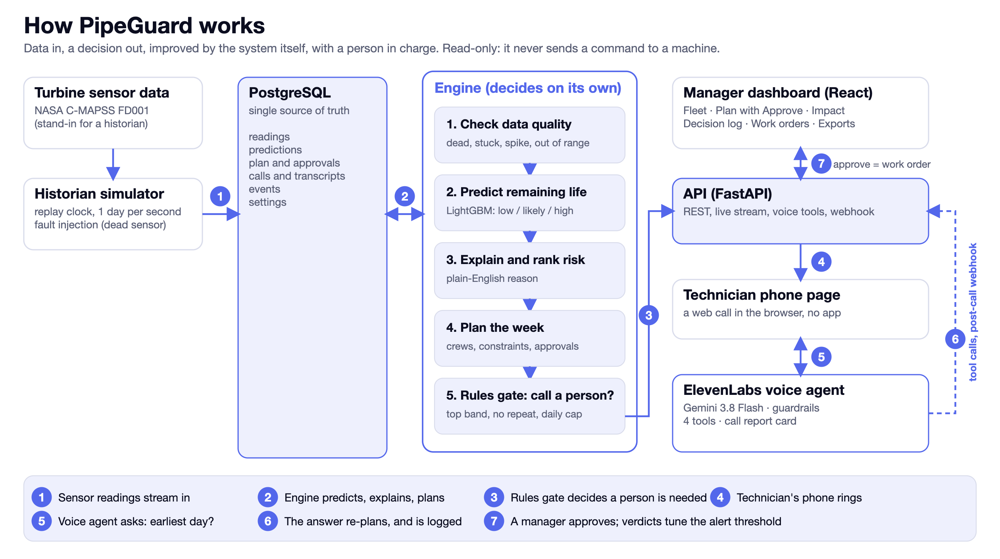
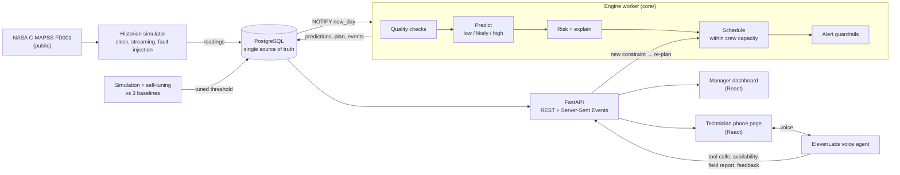

# PipeGuard

**Predicts which pipeline compressor turbine will fail next, schedules the fix within crew limits, and phones the on-call technician. Their spoken answer re-plans the week.**

IEEE YP Industry Hackathon 2026 · Stream: **Energy and Infrastructure Systems** · Path: **Option A** (own problem statement)
Team: **Team Ace** · Olisemelie David, ML engine ([FILL: GitHub handle]) · Ebube Okutalukwe, backend ([FILL: GitHub handle]) · David Oreoluwa, dashboard, voice agent and pitch ([@duvtant](https://github.com/duvtant)) · Team captain: [FILL: name]

**Theme fit: "Autonomous Intelligence for Industrial Innovation".** This is a hard-engineering problem, not a productivity app: prognostics of a physical degradation process, probabilistic remaining-life estimation, simulation of maintenance policies, and optimisation of crew schedules under capacity constraints, with a voice agent that closes the loop with a human in the field.

> **Disclosure up front.** Prairie Gas Transmission, its technicians and every dollar figure are **simulated**. Turbine data is the public **NASA C-MAPSS FD001** turbofan dataset, used as a stand-in because operators do not publish turbine sensor data. We never claim it is pipeline data. See [Limits](#10-honest-limits).

| | |
|---|---|
| **Live demo** | https://pipeguard.blunelabs.com (deployed on a Hetzner server behind HTTPS; it replays a simulated fleet) |
| **Demo video (under 5 min)** | [FILL: video URL] |
| **Run it yourself** | `cp .env.example .env && make up`, then open http://localhost:8088 |
| **Dataset** | NASA C-MAPSS FD001, cited in [Credits](#14-credits-and-citations) |
| **Named naive baselines** | Run until it breaks · Fixed maintenance schedule · Starter-style linear model |
| **Option A organizer approval** | [FILL: date and channel of the written approval; the handbook requires problem and dataset validation by end of day Saturday] |
| **Submission issue** | [FILL: link to our GitHub Issue on nagusubra/industry-hackathon-lab] |

---

## 1. For reviewers: rubric to evidence

Every row points to something you can open, run or read. Weights are from the [judging rubric](https://github.com/nagusubra/industry-hackathon-lab/blob/main/JUDGING_RUBRIC.md).

| Criterion (weight) | What the rubric asks for | What we show | Where |
|---|---|---|---|
| **Autonomous Reasoning + Data-Driven Decisions (30%)** | Data in, decision out; one improvement round against a baseline; auto-flagging / auto-scheduling / adjustable rules | Sensor data goes in; a ranked, crew-limited **service plan** and an automatic **voice call** come out. The plan → score → change loop runs in code: predict and schedule, simulate cost against three baselines, then change the plan (self-tuned threshold, re-plan from the technician's answer, feedback). One improvement round: default vs self-tuned settings | [§3](#3-autonomous-reasoning-plan--score--change) · `core/scheduler.py` · `core/simulate.py` · `ml/tune.py` · `core/feedback.py` |
| **Real Industrial Problem & Relevance (20%)** | Clear problem for the stream, a real end user, a practitioner conversation | Gas compressor stations run on aeroderivative gas turbines; unplanned failure drops flow. Users: the maintenance manager and the on-call field technician. Public NASA turbine wear data, cited | [§2](#2-the-problem-and-who-has-it) |
| **Execution & Software Architecture (20%)** | Live demo with real output on screen; architecture diagram or data-flow map | Working end-to-end stack (Postgres, two workers, FastAPI, React, voice agent) in Docker Compose, deployed behind a stable HTTPS domain. Architecture diagram with the reasoning for each choice. Tests, deterministic reset, fallbacks | [§5](#5-architecture) · [§8](#8-run-it-and-verify-it) · `docs/techstack.md` |
| **Commercialization in Industry (15%)** | Realistic deployment, pilot site, scalability beyond the weekend | Read-only deployment inside the operator's network; a 100-day pilot plan with success tests; per-machine pricing; scaling path | [§9](#9-commercialization) |
| **Presentation & Demo Quality (15%)** | Structured 5-minute pitch; the demo is the centerpiece | A scripted 5-minute path, a reset-to-identical-state demo, a one-click simulated call, a backup video | [§4](#4-live-demo) |

---

## 2. The problem and who has it

**How gas moves.** Natural gas loses pressure over hundreds of kilometres of pipe. **Compressor stations** re-pressurise it. Many of those compressors are driven by **gas turbines**, often *aeroderivative* ones, which are jet engines adapted for ground use (for example the GE LM2500, derived from the CF6-6 aircraft engine, has a version built to drive pipeline gas compressors).

**What goes wrong.** A turbine wears out gradually and, if nobody catches it, fails suddenly. That station stops pushing gas, flow drops, downstream customers and power plants can lose supply, and the operator pays for emergency repair and lost throughput.

**How it is handled today, and why that is wasteful.**
- *Fixed schedule* (service every N days): wastes crew time on healthy units and still misses units that wear out early.
- *Run until it breaks*: cheapest right up to the breakdown, then the most expensive outcome.

**Who PipeGuard is for.**
- **Maintenance manager** at a mid-size Alberta gas operator: plans each week's work with limited crews and has to justify the spend.
- **On-call field technician**: does the work, often far from the office, and needs a short, clear call, not a dashboard.

---

## 3. Autonomous reasoning: plan → score → change

The system makes and revises decisions without a person driving it. A person approves; PipeGuard recommends and never touches a control system.



### The decision pipeline (`core/`, `engine/`)
| Step | What it does | Code |
|---|---|---|
| 0. Check data quality | Catches dead, stuck, spiking and out-of-range sensors **before** they reach the model. A broken sensor triggers an *instrument check*, never a crew call | `core/quality.py` |
| 1. Predict | Remaining life as a **range** (low, likely, high) on every new reading, using LightGBM quantile models on rolling means, slopes and trends | `core/features.py`, `core/predict.py`, `ml/train.py` |
| 2. Explain | Names the sensor that drifted most, in plain words ("compressor outlet temperature rising for 6 days") | `core/explain.py` |
| 3. Decide | Turns the range into a probability of failure, then picks which units to service this week by `P(fail) × breakdown cost − service cost`, within crew capacity. Units with no feasible slot are flagged *needs manager decision*, never dropped silently | `core/risk.py`, `core/scheduler.py` |
| 4. Score | Replays the fleet and compares **run to failure**, **fixed schedule** and **PipeGuard** on breakdowns, wasted services, crew-days and dollars | `core/simulate.py` |
| 5. Self-tune | Searches the alert threshold and horizon and keeps the cheapest, using cross-fitted predictions only | `ml/tune.py` |
| 6. Re-plan | A technician's answer ("not before Friday") becomes a constraint and the schedule is rebuilt in under a second | `api/routers/voice.py`, `core/scheduler.py` |
| 7. Learn | Technician verdicts (*confirmed wear*, *looks fine*, *part replaced*) move the alert threshold within bounds | `core/feedback.py` |

### Baselines (the lazy approaches we must beat)
1. **Run until it breaks**
2. **Fixed schedule** (service every N days)
3. **Starter-style linear model** (5 sensors)

### Results: first result vs improved result
**Prediction quality** (NASA's official test set, last cycle of each engine). The first row is the result we measured before building the product; the second is produced by the shipped code (`make evaluate`).

| Model | Average error (cycles) | Failing engines caught (of 25) | False alarms |
|---|---|---|---|
| Starter-style linear model (named baseline) | 27.5 | 12 | 0 |
| Gradient boosting, capped RUL, untuned (first result) | 14.2 | 19 | 1 |
| **PipeGuard final models** (quantile LightGBM, trained on augmented data) | **11.4** | **18** | 1 |

Same test set, other measures (from `ml/artifacts/metadata.json`):

| Measure | Starter-style linear | PipeGuard final |
|---|---|---|
| RMSE (cycles, lower is better) | 34.87 | **14.30** |
| NASA asymmetric score (lower is better) | 26,282 | **397** |
| Coverage of the 80% range (target 70 to 90%) | not applicable | 0.82 |

The untuned first result caught one more failing engine (19 against 18) but its error was larger; the final model is the better estimator and gives honest ranges. We report both.

**Decision quality** (Impact tab, cross-fitted predictions, 100 turbines; the cost figures are illustrative assumptions, adjustable in the UI):

| Policy | Breakdowns | Wasted services | Total cost |
|---|---|---|---|
| Run until it breaks | 181 | 0 | $36.2M |
| Fixed schedule (every 120 days) | 0 | 234 of 337 services | $6.74M |
| **PipeGuard, self-tuned (the improvement round)** | 0 | 0 of 206 services | **$4.12M** |

**The improvement round.** PipeGuard's default alert setting (probability 0.5, 14 days ahead) costs $3.92M but gives the full two weeks of warning for only 22 of 100 failures (median warning 11 days). Tuning the setting on cross-fitted predictions (probability 0.3, 21 days ahead) raises that to **96 of 100** (median warning 20 days) for **$200K more**, about 5%. A check that tuned on 60 engines and scored on the other 40 picked the same setting. The self-tuned run is the one reported in the first table.

**Headline:** PipeGuard would have caught 96 of 100 failures at least 14 days early, with 0 false alarms (for 80% of units the first warning came 15 to 26 days ahead). *Definition:* **detected** = flagged at risk at least 14 days before failure; **actioned** = also serviced in time given crew capacity. We report both.

### Why the numbers can be trusted
- **Cross-fitting.** The model is trained on 80% of the engines and predicts the other 20%, rotating through five folds. **Every turbine in the live demo is predicted by a fold model that never saw it.**
- **No test-set tuning.** Thresholds and settings are tuned on cross-fitted predictions only. The official test set is used once, for the benchmark.
- **Live equals offline.** An automated test replays a clean unit through the live code path and checks it matches the cross-fitted predictions (`ml/tests/`).
- **Honest ranges.** We report the coverage of the stated range, and the calibration of the failure probability, instead of one confident number.

### Edge cases and guardrails
| Situation | Behaviour |
|---|---|
| Dead sensor | Prediction continues on the other sensors with a **wider range and "low confidence"**; instrument check requested; no crew call |
| Stuck, spiking or impossible values | Thrown out so they cannot cause a false alarm; instrument check requested |
| Low-resolution sensors that legitimately repeat | Stuck-sensor rule is calibrated **per sensor** on clean data (zero flags across all 100 healthy engines is an acceptance test) |
| Jumpy live data | A unit must stay in the danger zone for **3 readings in a row**, with hysteresis on the way out |
| Little history | Wide range and a "low confidence" label, not fake precision |
| All crews booked | Unit flagged **needs manager decision**; never fails silently |
| Technician free only after the unit may already have failed | Honest answer on the call, manager alert in the app |
| Alarm fatigue | Calls only for top-priority units, a daily cap per technician, no repeat call for the same unit within a window |
| Nobody answers | Backup technician rings after 30 s, then the manager is alerted |
| Unclear answer on the call | The agent confirms back ("So Friday, correct?") before acting |
| Voice service down | One-click **simulate call** replays a real recorded call through the same code path |
| Live inference error | Engine switches to precomputed predictions and labels them `fallback` |

---

## 4. Live demo

**Try it:** https://pipeguard.blunelabs.com (one-click sign-in as *Maintenance Manager*, no account needed). Press play on the fleet view.

| Screen | What it shows |
|---|---|
| **Fleet** | 5 stations, 100 turbines, status colours (green, yellow, red, grey with a wrench for sensor issues) updating live as a replay clock runs |
| **Unit detail** | Remaining-life range, why it was flagged, sensor trends, history |
| **Impact** | PipeGuard vs fixed schedule vs run-to-failure. Sliders for crew size and breakdown cost re-run the simulation live. Default vs self-tuned settings side by side |
| **Weekly plan** | Which units get serviced, by whom, and why |
| **Decision log** | Each alert as a chain: sensor drift → prediction → call → technician's answer → plan change → feedback |
| **Roster, Work orders, Settings** | Technicians and languages, downloadable weekly service list, crew size and cost assumptions |
| **Test mode** | Kill or corrupt a sensor on any unit; reset to the identical starting state; simulate a call |
| **Technician phone page** | Runs on a phone: incoming call, live voice conversation, verdict buttons |

**Screenshots** (taken from the deployed server)

| | |
|---|---|
|  |  |
| 1. Fleet overview: one unit at risk, with remaining-life range and reason | 2. Plan: a proposed change waiting for a manager's Approve |
|  |  |
| 3. Impact: yearly cost of PipeGuard against the two baselines | 4. Decision log: the call, the transcript and what it changed |
|  | |
| 5. Technician phone page: the incoming call | |

**The five-minute path** (what we show judges, following the handbook's recommended structure of intro, problem, software demo, wrap-up; 5 minutes plus 3 minutes of Q&A)
1. **Intro** (10 s): the team, one line each.
2. **Problem and user** (60 s): compressor stations, turbines, the cost of surprise failures, how it is handled today, and who benefits. Option A and the NASA dataset are stated up front.
3. **Live demo** (120 s): play the replay; a unit turns red; the voice agent phones the technician; a teammate answers *"not before Friday"*; the plan changes on screen; the Impact tab updates; drag a slider. About 15 seconds of this is the **sensor-fault moment**: kill a sensor in Test mode, the unit goes grey with a wrench and no crew is called. *A broken sensor is not a broken turbine.*
4. **Architecture, decision-making and results** (60 s): one diagram, the plan → score → change loop, the before and after numbers.
5. **Business case and close** (50 s): first customer, 100-day pilot, pricing, scaling, one closing line.

**Reliability for the demo.** The scenario is deterministic: **Reset** returns the identical starting state, so every rehearsal matches the pitch. Fallbacks: a recorded-call replay, precomputed predictions, a second deployment, and a backup video.

---

## 5. Architecture



The same flow as a Mermaid diagram, with the reasoning for each choice below it:



### Why it is built this way
| Choice | Reason (efficiency, cost, ease of use) |
|---|---|
| **PostgreSQL as the single source of truth and message bus** (`LISTEN/NOTIFY`) | Several processes write at once; production-grade; no queue to run, so fewer things break. Two workers and no Redis or Kafka |
| **LightGBM quantile models** | Strong on tabular sensor data, handles missing sensors natively (needed for fault tolerance), gives a **range** not a point, trains in seconds, explainable. Deep learning gains only a few cycles on this dataset and costs speed and explainability |
| **Pure functions in `core/`** | Prediction, risk, scheduling and simulation have no database or network calls, so the live engine, the Impact simulation and the voice re-plan all call **the same code** and are unit-testable |
| **FastAPI + Server-Sent Events** | Python keeps model and API in one language; SSE is one-way, simple and proxy-friendly, with polling fallback |
| **React + Vite** | A product-grade manager dashboard and a mobile technician page from one codebase |
| **ElevenLabs Agents** | One platform for speech-to-text, LLM, text-to-speech and turn-taking; our API is exposed to the agent as authenticated tools, so a spoken answer changes real state |
| **Docker Compose + Caddy on a Hetzner server** | One command brings up the whole stack; Caddy gives automatic HTTPS at a stable address for the voice platform to call |
| **Read-only by design** | Reads sensor data the operator already stores; never writes to control systems; humans decide |

Full technical specification: [`docs/techstack.md`](docs/techstack.md). Schema, API, message flow and failure modes are all in it.

---

## 6. Voice agent (ElevenLabs)

The call is not decoration: it changes decisions. A technician's answer becomes a constraint and the engine re-plans.

1. **Alert call.** *"Unit 14 at Edson has about 20 to 35 days left. Compressor outlet temperature has risen for six days. Can your crew service it by Thursday?"* The answer re-plans the week.
2. **Field report.** After the job the technician speaks a note; it is stored and the unit's status updates.
3. **Feedback verdict.** *Confirmed wear / looks fine / part replaced.* PipeGuard tracks how often its warnings are right and nudges the alert threshold.
4. **Multilingual (roadmap).** The agent supports per-technician language overrides, but we only tested English calls, so French is not a claim of this submission.

**How deeply we use ElevenLabs** (our entry for *Best Project Built with ElevenLabs*)

| ElevenLabs capability | How PipeGuard uses it |
|---|---|
| **Agents platform** | A private conversational agent ("PipeGuard Dispatcher") holds the call: speech-to-text, LLM, text-to-speech and turn-taking |
| **Server tools** | Four authenticated tools the agent calls **mid-call** against our API: `submit_availability` (re-plans the week), `field_report`, `feedback`, `get_unit_status` |
| **Signed URLs + dynamic variables** | Our server mints a short-lived signed URL per call and injects the unit, station, remaining-life range, reason and simulated date, so the agent only speaks facts we pass in |
| **Language overrides** | Set per technician at session start (English tested; other languages are roadmap) |
| **Data collection** | Structured extraction after the call (available day, verdict, and an **English summary** of a French call) |
| **Post-call webhooks** | Transcript and analysis arrive signature-verified and are linked to the decision log; a conversation pull is the fallback if a webhook is lost |
| **Agent testing** | A frozen text-test suite (8 critical tests run twice, held-out tests and 3 simulations), run against five candidate LLMs, chose the model ([`docs/llm_test_results.md`](docs/llm_test_results.md)) |
| **React SDK** | The technician's phone page starts and runs the live voice session |

**Security.** The browser never sees an API key (it gets a short-lived signed URL). Tool endpoints require a bearer secret, webhooks are signature-verified, and every action is logged in the decision log.

**Choosing the model inside the agent.** Chosen by measurement, not by leaderboard: a frozen test suite plus live latency runs on real calls. **Chosen: Gemini 3.8 Flash (low reasoning effort)**: 16 of 16 on the critical tool-call tests, the cheapest of the finalists (about half the cost of Claude Sonnet 5.5) and fast enough for a live call. Results and the decision rule: [`docs/llm_test_results.md`](docs/llm_test_results.md).

---

## 7. Data

**Real public data:** NASA C-MAPSS FD001 (Turbofan Engine Degradation Simulation), in `ml/data/`.

| File | Contents |
|---|---|
| `train_FD001.txt` | 100 engines run from healthy to failure, 20,631 rows |
| `test_FD001.txt` | 100 engines cut off before failure, 13,096 rows |
| `RUL_FD001.txt` | True remaining life for each test engine (the answer key) |

Each row: engine id, cycle, 3 operating settings, 21 sensors. 14 sensors carry wear signal and are used; the rest are flat and dropped. Lifetimes range from 128 to 362 cycles (median 199). One operating condition, one failure mode (high-pressure compressor degradation).

**Why this dataset fits.** Operators do not publish turbine sensor data. C-MAPSS is the standard public benchmark for turbine wear, and its failure mode (compressor-section wear in a jet engine) matches the aeroderivative turbines that drive many pipeline compressors. The method transfers; in a pilot the model is retrained on the operator's own data.

**What is simulated, clearly labelled.**
- *Prairie Gas Transmission* (fictional): 5 stations named after Alberta towns, 100 turbines mapped one-to-one to the 100 **training** engines (they run to real failure, so failures appear in the replay).
- A **historian simulator** streams each turbine's NASA readings forward one day at a time, as a real operator's historian would. **No failures are invented and no sensor values are altered.** We only choose where each unit's replay starts so the demo reaches interesting moments, and we say so openly. 1 cycle = 1 day.
- Technician roster, crew capacity and **illustrative** costs (unplanned breakdown $200,000, planned service $20,000). Round numbers, not industry data.

---

## 8. Run it and verify it

**Run everything** (Docker required):
```bash
cp .env.example .env     # add your own keys locally; .env is git-ignored
make up                  # db, api, engine, simulator, web
open http://localhost:8088
```
Voice calls need ElevenLabs credentials in `.env`. Without them, use **Test mode → Simulate call**, which replays a recorded call through the same code path.

**Verify the claims**

| Claim | How to check |
|---|---|
| Beats the baseline on NASA's test set | `make evaluate` prints the table in §3 and writes `ml/artifacts/metadata.json` |
| Live predictions equal the cross-fitted ones | `make test` (see `ml/tests/`) |
| No false sensor alarms on healthy data | `make test`: the quality checker raises zero flags across all 100 clean training engines |
| Demo is deterministic | `make reset`, then replay: the same unit turns red at the same time |
| Impact simulation is fast | `POST /api/simulate` returns `computed_ms` (target under 1 second) |
| A spoken answer changes the plan | Test mode → Simulate call, then open Decision log: constraint → plan change → summary |
| No secrets in the repo | `./scripts/preflight` |

**Repository map**
```
core/        pure decision logic: features, quality, predict, risk, explain, scheduler, simulate, feedback
engine/      worker: new reading → quality → predict → plan → alerts
simulator/   historian simulator: clock, streaming, fault injection
api/         FastAPI: REST, live updates, voice tool endpoints, webhooks
web/         React: manager dashboard and technician phone page
ml/          training, evaluation, tuning, scenario generation, artifacts, tests
infra/       Docker Compose, nginx, Caddy, seed data
docs/        overview, technical specification, team guides, LLM test results
```

---

## 9. Commercialization

**Value.** PipeGuard tells maintenance teams which compressor turbine will fail next, weeks ahead, so they fix it on their schedule instead of losing gas flow to a surprise breakdown.

**Why us over the incumbents.** Large vendors already sell predictive maintenance, but those are big, expensive systems that take months to roll out. PipeGuard is lightweight, priced for mid-size operators, live in weeks, and built for field crews with voice calls, not only a control-room dashboard.

**First customer.** A mid-size Alberta gas operator with dozens of compressors: enough machines to feel the pain, not the budget for the big systems. Alternative: a compression-services company that maintains compressors for many clients, which means one customer and many sites.

**Deployment (realistic, low-friction).**
1. A **read-only** connection to the operator's existing data historian. No new sensors or hardware.
2. Runs **inside their environment** (self-hosted, Docker Compose).
3. Manager gets the dashboard; technicians get voice calls.
4. Humans decide. PipeGuard never controls a machine.

**100-day pilot plan**

| Phase | What happens | Success test |
|---|---|---|
| Week 1 | Talk to 5 to 10 industry people; confirm the pain; request historical sensor data and repair logs | One company agrees to share data |
| Days 1 to 30 | Pilot agreement for 10 to 20 machines; retrain on 2 to 3 years of their data | Would PipeGuard have warned before their last 5 breakdowns? |
| Days 31 to 60 | **Shadow mode** alongside their normal process; nobody acts on it | Warnings match what actually happens; false alarms tuned |
| Days 61 to 100 | Live at one station: dashboard and voice calls | Breakdowns caught, false alarms, crew hours saved; convert to paid |

**Pricing.** A monthly fee per machine monitored, framed as a small fraction of one surprise breakdown.

**Scaling.** More stations at the same operator → more operators across Alberta and Canada → more machine types (piston-engine compressors, pumps, power-plant gas turbines) → resellers such as control-room automation companies. Each new customer is cheaper to start because the model, pipeline and setup are reusable.

**Trust and safety.** Read-only; data stays with the operator; humans always decide; call limits prevent alarm fatigue.

---

## 10. Honest limits

- The data is a **stand-in**: NASA turbofan simulation, not real pipeline data. One operating condition and one failure mode. Both are addressed by retraining on an operator's own data in the pilot.
- The demo fleet is the NASA **training** set (run-to-failure histories); accuracy figures come from NASA's separate test set. The self-tuned settings and Impact numbers are computed on the same 100 engines using cross-fitted predictions, so they describe this fleet, not a guarantee for another.
- All costs are illustrative round numbers. Use the sliders.
- Many field compressors are piston-driven, not turbine-driven. We start where our data fits and extend the method once we have their data.
- Not built in this weekend: telephone-network calling (the demo call runs in a browser), a mathematical optimizer for scheduling (greedy today), multi-tenant accounts, French calls, and the "ask a manager" switch in Settings (it is always on in this version).

---

## 11. Responsible and transparent AI

The handbook asks for responsible, transparent agent design and attention to algorithmic bias. How PipeGuard handles it:

| Concern | What we do |
|---|---|
| **Humans decide** | PipeGuard recommends. Managers approve plans and technicians act. It is read-only and never writes to a control system |
| **Explainable alerts** | Every flag carries a plain-language reason, a remaining-life **range** and a confidence label. The decision log records the full chain from sensor drift to technician answer, and every prediction stores its model version |
| **No false precision** | Sparse history, a dead sensor or masked values produce a **wider range and "low confidence"**, never a confident-looking number. Range coverage and probability calibration are reported (§3) |
| **Data bias and generalisation** | The training data covers one operating condition and one failure mode, so we state the limit (§10), cross-fit so the demo never scores a turbine with a model that saw it, and require **shadow-mode validation** on an operator's own data before anyone acts on a warning |
| **Alarm fatigue** | Priority band, daily call cap per technician, no duplicate calls, backup and escalation paths |
| **Voice agent honesty** | It speaks only the facts we inject, cannot invent numbers or engineering instructions, declines off-topic requests, and says it is an automated dispatcher assistant when asked. Calls and transcripts are stored for audit. No real person's voice is cloned |
| **Inclusive operation** | Technicians are called in their preferred language, with an English summary for the manager |
| **Privacy** | Public data only; the roster is fictional; secrets stay out of the repository and the browser |

## 12. Originality and attribution

- All application code was written during the hackathon window (October 2 to 4, 2026); the commit history in this repository shows it. The starter-style linear baseline (27.5 average error) comes from the starter script kept in `ml/legacy/agent_starter.py`, which we reused as the named baseline; the rest of `ml/` is new.
- Open-source building blocks: PostgreSQL, FastAPI, SQLModel, psycopg, Pydantic, LightGBM, scikit-learn, pandas, NumPy, PyArrow, React, Vite, Tailwind CSS, Recharts, TanStack Query, React Router, nginx, Docker, Caddy, and the ElevenLabs SDKs.
- Data: NASA C-MAPSS FD001 (see §14).

## 13. Team

| Who | Built |
|---|---|
| **Olise** | ML engine: cross-fitted training, data-quality checks, prediction with ranges, explanations, risk, scheduler, simulation, self-tuning, feedback |
| **Ebube** | Backend: database, historian simulator, FastAPI, live updates, call guardrails, deployment |
| **David** | Dashboard, technician phone page, ElevenLabs voice agent and model test, pitch |

## 14. Credits and citations

- **Dataset:** NASA C-MAPSS FD001, bundled in the [hackathon repository](https://github.com/nagusubra/industry-hackathon-lab). A. Saxena, K. Goebel, D. Simon, N. Eklund, "Damage Propagation Modeling for Aircraft Engine Run-to-Failure Simulation," *International Conference on Prognostics and Health Management (PHM)*, 2008.
- **Voice:** [ElevenLabs](https://elevenlabs.io) Agents (hackathon sponsor technology).
- **Context:** [GE LM2500 aeroderivative gas turbine](https://en.wikipedia.org/wiki/General_Electric_LM2500); [Rolls-Royce RB211 gas compression packages for a Canadian pipeline](https://www.rolls-royce.com/media/press-releases-archive/yr-2007/rr-rb211-gas.aspx).
- **Roster photos:** the twelve technician headshots are AI-generated images of fictional people (no real person is depicted). Prompts are in `docs/design/ROSTER_HEADSHOTS.md`.
- **Reused code:** eight interaction components (slide-over, value flash, action button, hold to confirm, skeleton timing, new-events pill, segmented control, snap-point slider) were adapted from [interior.dev](https://www.interior.dev/) (MIT, copyright 2026 ozzy). Each adapted file names its original, and the licence text is in [`docs/design/vendor/interior/LICENSE`](docs/design/vendor/interior/LICENSE). Everything else was written for this project.
- **Judging rubric:** [JUDGING_RUBRIC.md](https://github.com/nagusubra/industry-hackathon-lab/blob/main/JUDGING_RUBRIC.md).

**Further reading:** [`docs/PipeGuard_Overview.md`](docs/PipeGuard_Overview.md) (product, pitch, business case) · [`docs/techstack.md`](docs/techstack.md) (technical specification) · [`docs/delegation/`](docs/delegation/) (how the three of us split and integrated the work).
