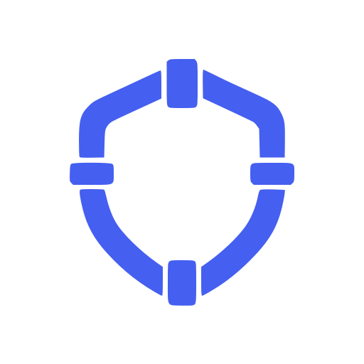
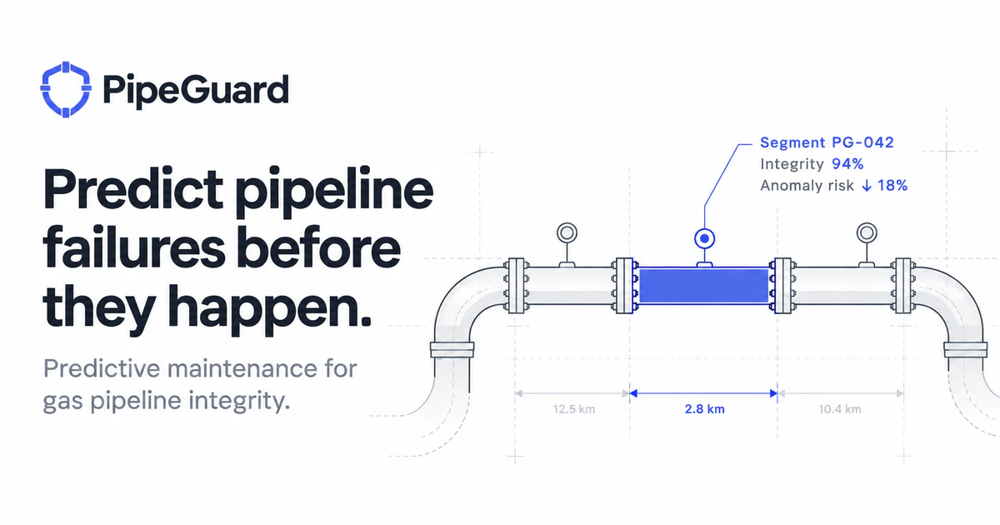
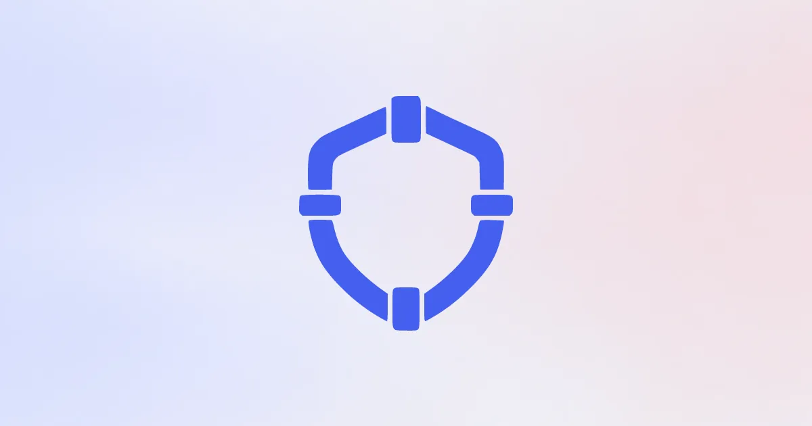
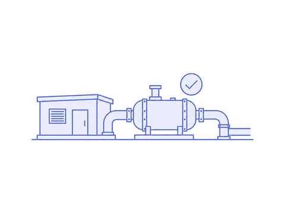
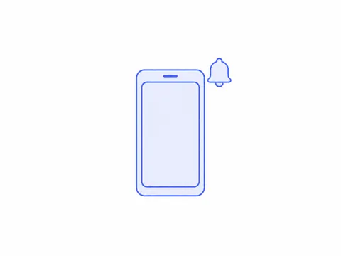
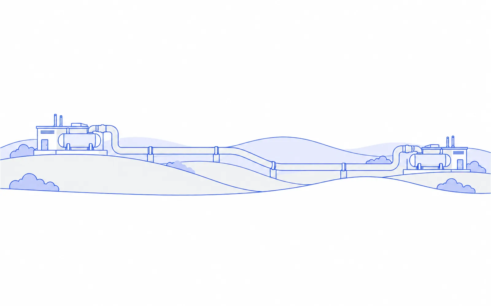

# PipeGuard visual assets

The [roster headshots](headshots-src/README.md) are twelve AI-generated photos of fictional technicians, saved as `headshots-src/tech-1.png` through `tech-12.png` at 1024 × 1024. Their separate prompt and verification record is in [headshots-src/generation.json](headshots-src/generation.json).

Illustrations and mesh backgrounds were generated with the built-in OpenAI image generator, using `docs/design/DESIGN.md` Section 8. Sunburst was unavailable; the built-in alternative was explicitly approved. The tool does not expose its underlying model ID. The logo is David's supplied `proposedlogo.png`, converted into the formats below.

The set uses the Mercury-inspired light palette, quiet mesh backgrounds, fine periwinkle illustration outlines, pale fills, and generous white space. Generated illustrations contain no baked-in text; pair them with the app's Figtree typography. David's supplied OpenGraph card includes its own typography. UI icons remain the bundled Phosphor set specified in Section 7.

| Asset | File | Dimensions | Size |
|---|---|---|---|
| Logo mark | [SVG](logo-mark.svg), [WebP fallback](logo-mark.webp), [PNG](logo-mark.png) | 512 × 512; scalable SVG | 3.7 / 16.0 / 56.8 KB |
| Favicon | [SVG](favicon.svg), [ICO](favicon.ico), [PNG](favicon-32.png) | Scalable SVG; ICO: 16, 32, 48 px; PNG: 32 × 32 | 3.7 / 2.6 / 0.9 KB |
| Phone home-screen icon | [Apple touch icon](apple-touch-icon.png) | 180 × 180 PNG | 2.0 KB |
| Manifest icons | [192 px](icon-192.png), [512 px](icon-512.png) | 192 × 192 and 512 × 512 PNG | 2.0 / 5.7 KB |
| OpenGraph card (user artwork) | [PNG](opengraph-optimized.png), [WebP](opengraph-optimized.webp) | 1200 × 630 | 545.6 / 51.6 KB |
| Alternate logo-only preview | [PNG](social-preview.png), [WebP](social-preview.webp) | 1200 × 630 | 38.1 / 7.5 KB |
| Insight mesh | [mesh-insight.webp](mesh-insight.webp) | 1920 × 1080 | 7.3 KB |
| Calm mesh | [mesh-calm.webp](mesh-calm.webp) | 1200 × 800 | 3.2 KB |
| Attention mesh | [mesh-attention.webp](mesh-attention.webp) | 1200 × 800 | 3.1 KB |
| All-clear illustration | [empty-all-clear.webp](empty-all-clear.webp) | 480 × 360 | 5.3 KB |
| Waiting-for-call illustration | [empty-waiting-for-call.webp](empty-waiting-for-call.webp) | 480 × 360 | 1.8 KB |
| Sign-in illustration | [sign-in.webp](sign-in.webp) | 1600 × 1000 | 28.2 KB |

Section 8 does not specify filenames or logo dimensions. Descriptive filenames and a 512 × 512 logo canvas were chosen for this export. The asset table's dimensions take precedence over the mesh prompt's generic 1920 × 1080 wording for Calm and Attention.

David selected [proposedlogo.png](proposedlogo.png): a shield formed from pipe segments and four coupling blocks. The original 1254 × 1254 PNG is preserved. The main logo and favicon exports have transparent backgrounds. The SVG uses real traced vector paths and a flat `#455FF0` fill sampled from the source; PNG/WebP retain its original blue variation. Minor isolated raster speckles were removed by vector tracing. Favicon versions use the same geometry with tighter framing. The prior generated logos have been removed from this assets folder. This logo choice does not mark the project's broader design gate approved.

Home-screen and manifest icons are rendered directly from `logo-mark.svg`, with opaque white backgrounds and square canvases. Corners are not baked in; the operating system applies its own icon mask. The 192 and 512 px exports are for manifest entries with `type: "image/png"` and `purpose: "any"`. These files are prepared assets; this task does not wire them into the web app.

David's [original OpenGraph card](opengraph.png) is preserved at 1731 × 909 (1,024,043 bytes). The optimized exports retain its artwork and text at 1200 × 630 without cropping. Use [the PNG](opengraph-optimized.png) for social OpenGraph metadata and the GitHub issue/deck; use [the WebP](opengraph-optimized.webp) for smaller website images. WebP quality 90 keeps the small text and fine linework readable while reducing file size by 95%. No app metadata is changed by this export.

The earlier alternate social preview composes the Insight mesh and the centered logo at 1200 × 630, without text or new generated imagery.

Illustration, mesh, logo, and alternate preview WebPs are encoded at quality 80; the user-supplied OpenGraph card uses quality 90. Each export was checked for its actual format and exact dimensions and fully decoded. Large WebP assets are below 120,000 bytes, and small WebPs are below 40,000 bytes. The lossless PNG logo and supplied original are outside those WebP optimization limits. Both SVGs were rendered successfully and checked for vector paths rather than embedded bitmaps; all three ICO frames were decoded, and raster logo transparency was verified. Visual review included the original generated set and a simulated washed-out preview, followed by the supplied logo's vector rendering and its favicon at 32 px. This is a software preview; a physical projector check remains part of the product review.

Prompts for the generated illustrations/backgrounds, the supplied logo's conversion provenance, sizes, and hashes are recorded in [generation.json](generation.json) and [manifest.json](manifest.json).

Use the mesh images for the sign-in background, deck cover, and large empty states. In-app insight strips use the CSS gradients from Section 3.2. Set explicit `width` and `height` on consuming images, and treat decorative illustrations as `alt=""` when adjacent text already supplies their meaning.

All Section 8 asset categories are included; none were omitted.
